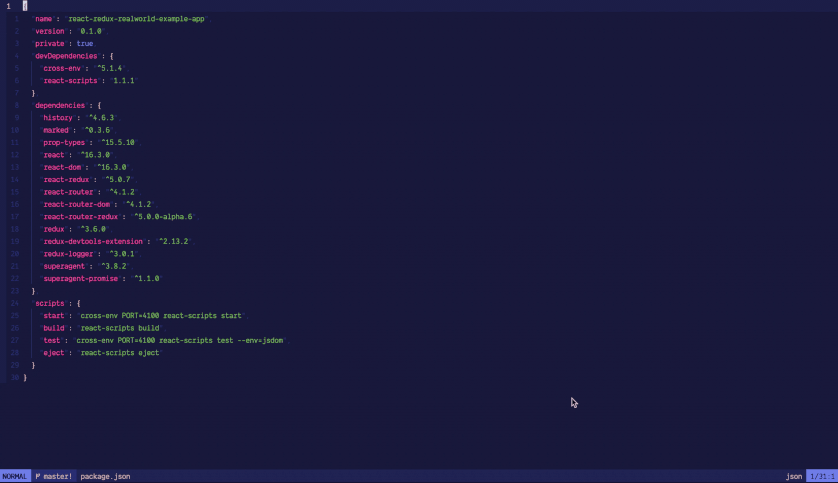

# tryptic.nvim

Directory viewer inspired by [Ranger](https://github.com/ranger/ranger) and [dirvish.vim](https://github.com/justinmk/vim-dirvish).



The UI opens in a new tab and consists of 3 buffers:

- The parent directory on the left
- The current directory in the middle
- The child directory or file preview on the right

Use `j` and `k` (or any other motions like `G`,  `gg`, `/` etc) to navigate within the current directory.
Use `h` and `l` to switch to the parent or child directories respectively. If the buffer on the right is a file, then pressing `l` will close Tryptic
and open that file in the buffer you were just in. _You always control the middle column_.

The advantage of this over other plugins like Netrw and Dirvish is that it provides context, which is missing when you can only see one directory at a time.

## Borrowed concepts

This plugin borrows 3 good ideas from [dirvish.vim](https://github.com/justinmk/vim-dirvish). Specifically that

- Each line is just a path that uses Vim's [conceal](https://neovim.io/doc/user/syntax.html#conceal) feature to make it pretty and readable.
- The buffer name is the current directory path
- Pressing `x` adds or remove the path under the cursor to a window-local arglist

All this works nicely with existing Vim concepts and features. For example:

- `yy` or `y$` to yank path into the register and do something with it
- Create directories with `:!mkdir %/boom`
- Create files with `:e %/boom.vim`

## Installation

Should work by whatever means you normally install plugins.

For example with vim-plug, add the following to your `.vimrc`.

```
Plug 'simonmclean/tryptic'
```

Then do `:source ~/.vimrc` and `:PlugInstall`.

### Key bindings

Tryptic doesn't come with any default keybindings, so add the following to your `.vimrc`:

```
" Launch Tryptic
nnoremap <leader>- :Tryptic<cr>

" Navigation
autocmd FileType tryptic nnoremap <silent> <buffer> h :call tryptic#HandleMoveLeft()<cr>
autocmd FileType tryptic nnoremap <silent> <buffer> l :call tryptic#HandleMoveRight()<cr>

" Close Tryptic
autocmd FileType tryptic nnoremap <silent> <buffer> q :tabclose<cr>

" Toggle hidden files
autocmd FileType tryptic nnoremap <silent> <buffer> <leader>. :call tryptic#ToggleHidden()<cr>

" Add or remove from arglist
autocmd FileType tryptic nnoremap <silent> <buffer> x :call tryptic#ToggleArglist()<cr>

" Refresh view
autocmd FileType tryptic nnoremap <silent> <buffer> R :call tryptic#Refresh()<cr>
```

## TODO

- Refactor so that state is per instance
- Maybe add trailing `/` to distinguish folders
- Create plugin docs
- There's probably a bunch of wierd behaviour that would result from using the plugin in unexpected ways
